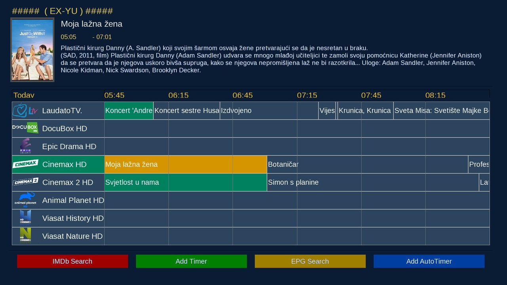
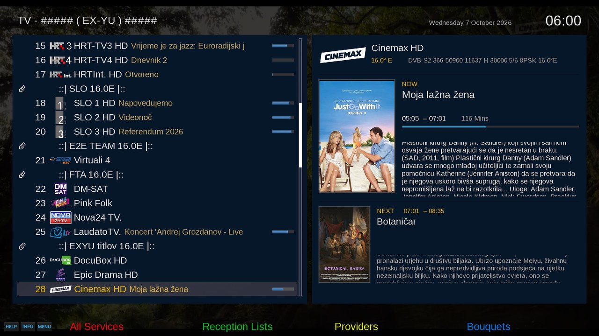
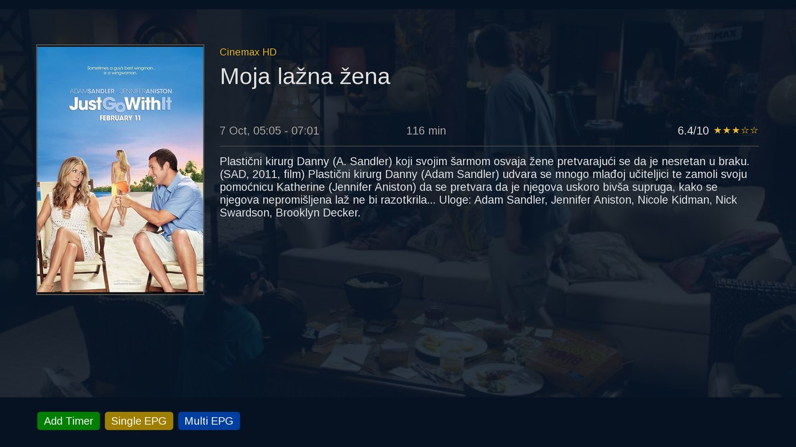
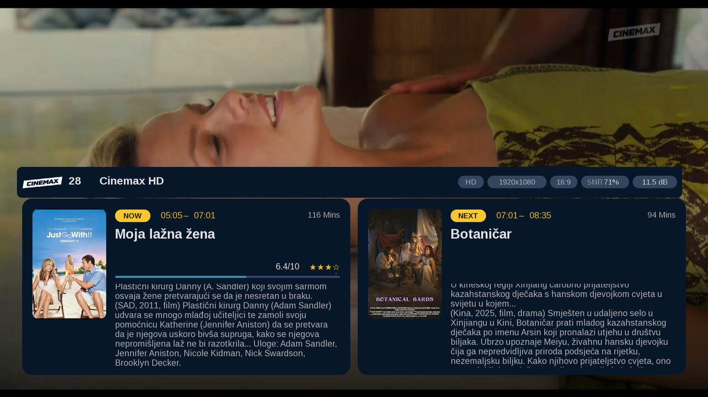
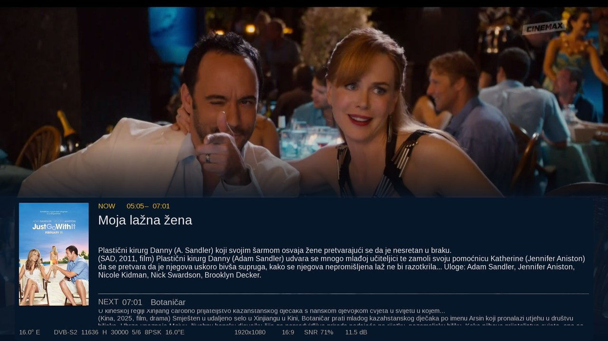
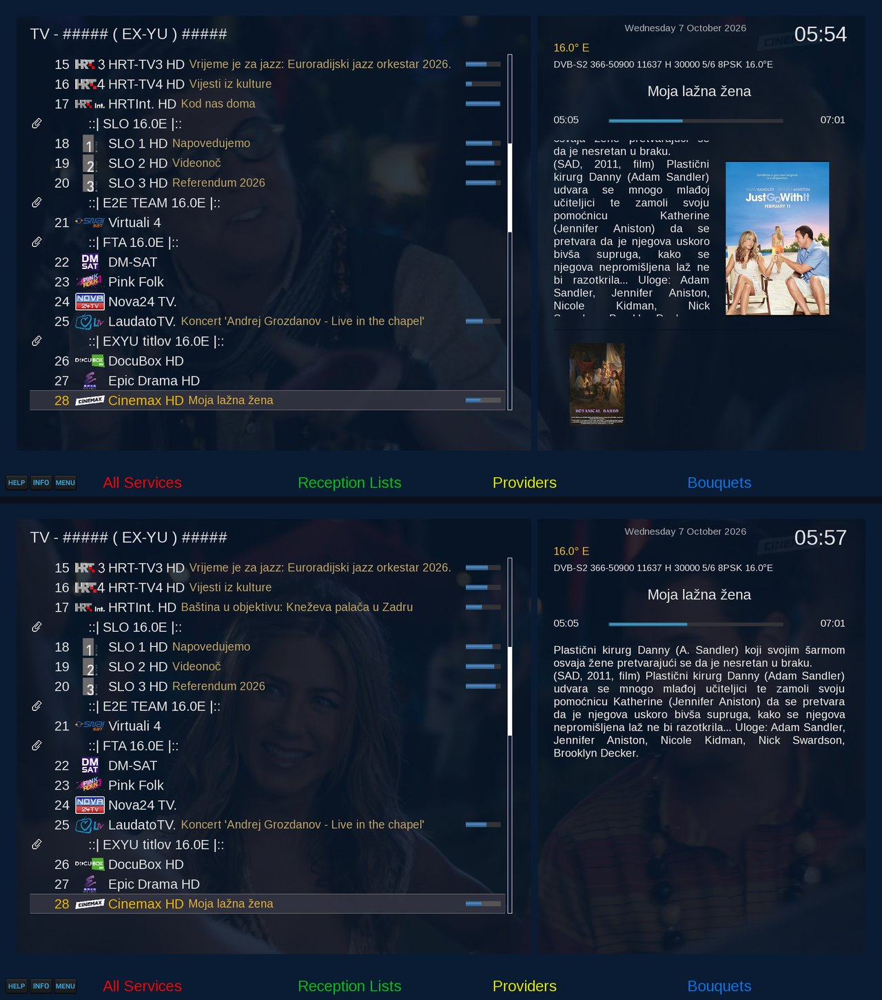
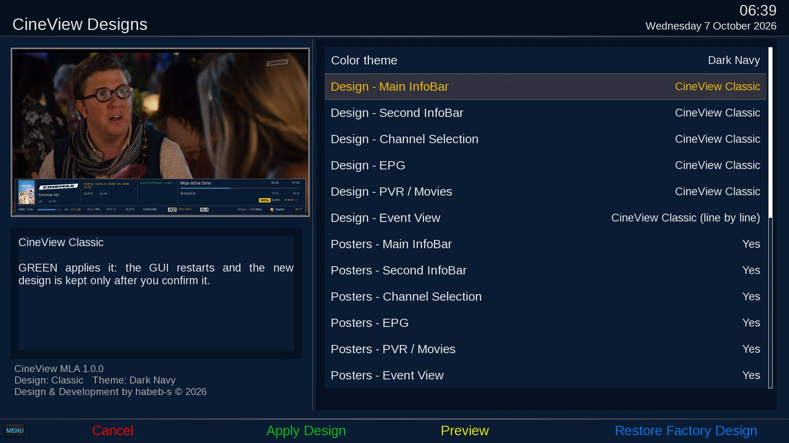

<p align="center"></p>

<h1 align="center">CineView MLA</h1>
<p align="center">A multi-layout Full-HD skin for OpenATV — five design models, six themes, one control screen.</p>
<p align="center"><b>Design &amp; Development by habeb-s © 2026</b></p>

## Highlights
- **Five design models** — Classic, Details, Cinema, Modern and Minimal.
- **Every section on its own** — InfoBar, Second InfoBar, Channel Selection, EPG, PVR and Event View can each use a
  different design.
- **Posters On / Off** — switch posters per section; with posters off the screen is re-arranged to use the space,
  never an empty frame.
- **Six themes** — Dark Navy, Black, Graphite, Deep Purple, Burgundy, Dark Green.
- **CineView Designs** — the control screen in the Plugin Browser: real previews of every design and theme, the
  posters on/off picture of each section, and a short card for every option.
- **Poster engine** — a poster is shown only when title, type and year match; otherwise the CineView default image.
- **Profiles** — save, load and delete your own combinations, or apply one design model to every section at once.
- **Safe apply with automatic rollback** — a new design is kept only after you confirm it; without confirmation, or
  after a problem at start, the previous design comes back by itself.

## Screenshots
| Classic | Details | Cinema |
|---|---|---|
|  |  |  |
| **Modern** | **Minimal** | **Posters On / Off** |
|  |  |  |

<p align="center"><br><sub>CineView Designs</sub></p>

## Compatibility
| | |
|---|---|
| Image | OpenATV 8.0 (Python 3.14) on Enigma2 receivers |
| Primary device used for full hardware QA | Vu+ Duo 4K SE (OpenATV 8.0.1) |
| Architecture | any (the package is architecture-independent) |
| Needs | python3-pillow, python3-requests (installed from the image feed when missing) |

CineView MLA is not tied to a receiver model: the installer checks the image, its version, Python, the required
components, the architecture and the free space, and stops — without changing anything — when something does not fit.

## Install
On the receiver (telnet / ssh):

```sh
wget -qO /tmp/cineview-install.sh "https://raw.githubusercontent.com/habeb-s/CineView-MLA/main/install/cineview-install.sh" && sh /tmp/cineview-install.sh
```

Then select **CineView_FHD_MLA** in *Menu › Setup › User Interface › Skin* and restart the GUI.
Open **CineView Designs** from the Plugin Browser to choose designs, themes and posters.

Options: `DRYRUN=1` checks only · `HDD_CACHE=0` keeps the poster cache off the hard disk · `RESTART=1` restarts the
GUI at the end.

## Update
Run the same command again. The installer shows the current and the new version and upgrades in place: your design,
theme, profiles, settings and poster cache are kept.

## Poster cache
One cache for every design: `/media/hdd/poster` when a hard disk is mounted read-write, otherwise USB storage, and
`/tmp` only as a last resort. The internal flash is never used as a permanent cache. Updates and a normal uninstall
never delete the cache.

## Uninstall / rollback
```sh
wget -qO /tmp/cineview-uninstall.sh "https://raw.githubusercontent.com/habeb-s/CineView-MLA/main/install/cineview-uninstall.sh" && sh /tmp/cineview-uninstall.sh
```
Keeps your profiles, settings and poster cache (`purge` also removes the settings and profiles).
To go back to an earlier release, install its package from the Releases page (`release/<version>/`). Inside CineView Designs,
**Restore Factory Design** returns to Classic + Navy at any time.

## Notes
- CineView MLA is a separate skin from the classic CineView FHD; both can stay installed.
- Licence: see LICENSE.

<p align="center"><sub>CineView MLA · Design &amp; Development by habeb-s © 2026</sub></p>
